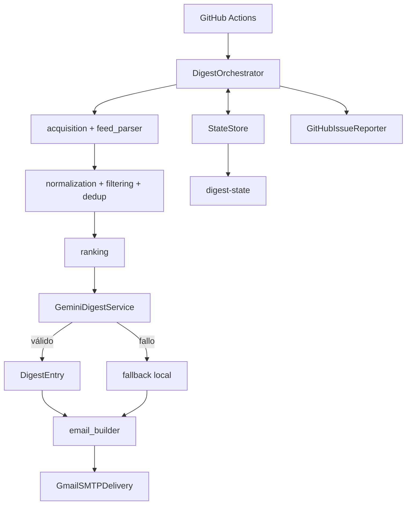
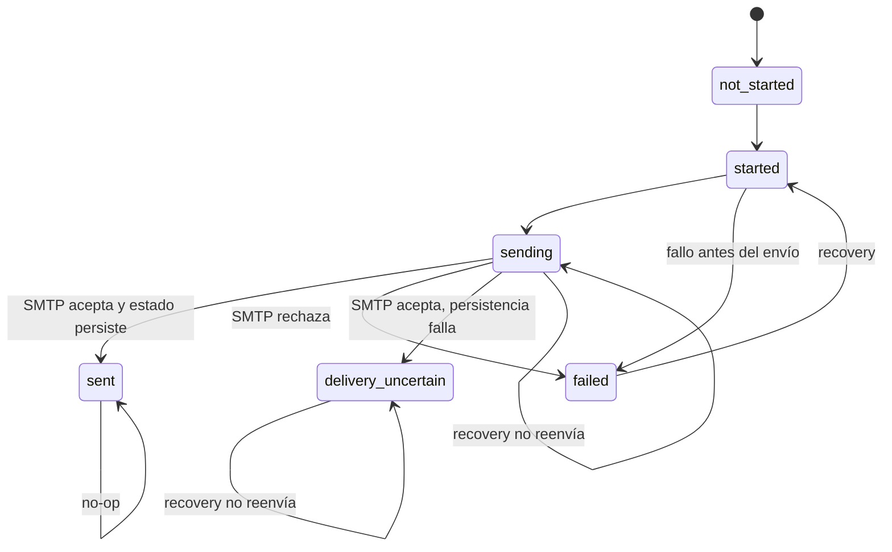

# Arquitectura

## Alcance

AI News Digest es un proceso batch diario. No expone servidor, UI ni base de
datos. Sus límites externos son feeds HTTP, Gemini, Gmail SMTP, Git/GitHub y el
filesystem del runner.

## Responsabilidades

- `config.py`: valida entorno, secretos y límites operativos.
- `acquisition.py`: concurrencia por fuente, timeout, tamaño y fallos parciales.
- `feed_parser.py`: convierte RSS/Atom no confiable a entradas validadas.
- `normalization.py`, `filtering.py`, `dedup.py`: reglas deterministas.
- `ranking.py`: puntuación legible y límite de 15 candidatos.
- `llm/gemini.py`: Interactions API, prompts, schemas y fallback.
- `summary.py`: validación y resumen local seguro.
- `email_builder.py`, `delivery/smtp.py`: MIME, escape, STARTTLS y aceptación.
- `persistence/`: JSON atómico, retención y operaciones Git sin force-push.
- `orchestrator.py`: transiciones, idempotencia y coordinación.
- `issues.py`: issue deduplicada por fecha local y tipo de error.

## Estado y recuperación

Los JSON se escriben en un temporal del mismo directorio, se vacían con `fsync`
y reemplazan atómicamente. `history.json` conserva 30 fechas. El workflow hace
commit y push a `digest-state`; ante non-fast-forward ejecuta pull/rebase y un
único reintento, nunca force-push.

## Fallbacks

- fuente caída: continuar con resultados parciales;
- fecha inválida: descartar esa entrada al normalizar;
- Gemini inválido/no disponible: ranking heurístico y resumen RSS;
- estado `sending` o `delivery_uncertain`: issue y revisión, sin SMTP automático.

## Límites y amenazas

Los feeds son entrada no confiable: se limitan bytes/entradas, se ignora markup,
se escapa HTML y se validan URLs. Los prompts prohíben hechos externos, pero un
LLM aún puede producir texto incorrecto; Pydantic valida forma, no veracidad.
Las credenciales dependen de GitHub Secrets y una contraseña de aplicación.
Artifacts contienen diagnósticos, nunca son persistencia primaria.

## No implementado deliberadamente

No hay scraping, Gmail API/OAuth, proveedor LLM alternativo, base de datos,
exactly-once, SLA, servicio web, contenedores obligatorios ni microservicios.
Estas exclusiones mantienen la arquitectura proporcional al problema.
