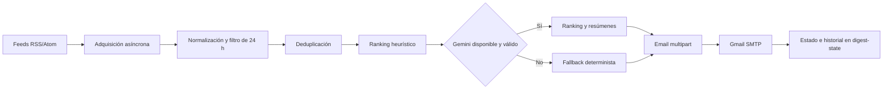

# AI News Digest


> Un agregador curado y automatizado de noticias sobre inteligencia artificial y
> hardware, con filtrado determinista, ranking asistido por Gemini, fallbacks
> locales, envío por correo y ejecución diaria mediante GitHub Actions.

AI News Digest consulta feeds RSS/Atom públicos, reduce ruido y duplicados,
selecciona hasta cinco novedades y genera un correo en español. Está diseñado
como proyecto público de portafolio: prioriza código tipado, estados observables,
pruebas sin Internet e integración explícita con servicios externos.

> El badge de CI debe añadirse cuando exista una URL pública real del repositorio:
> `https://github.com/<owner>/ai-news-digest/actions/workflows/ci.yml`.

## El problema

Seguir manualmente blogs de laboratorios de IA y fabricantes consume tiempo,
repite anuncios del mismo evento y mezcla novedades técnicas con contenido poco
relevante. Este proyecto automatiza una selección diaria auditable sin convertirse
en crawler, buscador general ni sistema de investigación.

## Características

- adquisición asíncrona con timeout, límite de bytes y aislamiento por fuente;
- normalización segura de HTML, fechas UTC y URLs canónicas;
- ventana inclusiva de las 24 horas previas al momento real de ejecución;
- filtro temático, deduplicación con RapidFuzz y ranking heurístico;
- ranking y resúmenes mediante Gemini con schemas Pydantic;
- fallback determinista si Gemini falla o devuelve datos inválidos;
- correo multipart HTML/texto y Gmail SMTP con STARTTLS;
- máquina de estados que evita reenvíos automáticos ambiguos;
- historial rotativo de 30 días en la rama `digest-state`;
- ejecución principal, recuperación, modo manual y `dry-run`;
- CI con Ruff, mypy, pytest y cobertura mínima del 70 %.

## Flujo



La ejecución principal se intenta a las 08:45 y la recuperación a las 09:15 de
Buenos Aires (`11:45` y `12:15` UTC). GitHub Actions no garantiza puntualidad:
los cron son intentos programados, no una promesa de hora exacta de entrega.

## Arquitectura

El código vive en `src/ai_news` y separa adquisición, parsing, reglas
deterministas, Gemini, email, entrega, persistencia y orquestación. Las
dependencias externas se inyectan en los límites que necesitan mocks. Consulta
[ARCHITECTURE.md](ARCHITECTURE.md) para responsabilidades, estado y riesgos.

## Ejemplo conceptual

```text
📰 AI News Digest — 25/07/2026

1. Título de una novedad técnica
Resumen en español basado únicamente en el título y descripción RSS.
Por qué importa: impacto breve para una persona que desarrolla con IA.
Fuente: fuente original · Leer noticia

Generado automáticamente.
```

La futura captura real debe añadirse manualmente como
`docs/images/digest-preview.png`; no se incluye una imagen inventada.

## Instalación local

Requisitos: Git, [uv](https://docs.astral.sh/uv/) y Python 3.12.

```bash
git clone <URL-REAL-DEL-REPOSITORIO>
cd ai-news-digest
uv sync --frozen
cp .env.example .env
```

Completa `.env` con credenciales locales. Nunca lo agregues a Git.

## Configuración

Variables no sensibles:

| Variable | Valor recomendado | Propósito |
|---|---|---|
| `LLM_PROVIDER` | `gemini` | Proveedor único implementado |
| `LLM_MODEL` | `gemini-3.5-flash` | Modelo estable y configurable |
| `RECIPIENT_EMAIL` | `delfatica777@gmail.com` | Destinatario inicial |
| `SMTP_HOST` | `smtp.gmail.com` | Servidor SMTP |
| `SMTP_PORT` | `587` | Puerto STARTTLS |
| `TIMEZONE` | `America/Argentina/Buenos_Aires` | Fecha local del digest |
| `REPOSITORY` | `owner/ai-news-digest` | Semilla de Message-ID e issues |

Secrets requeridos:

| Secret | Propósito |
|---|---|
| `LLM_API_KEY` | API key de Gemini |
| `SMTP_USERNAME` | Cuenta Gmail remitente |
| `SMTP_APP_PASSWORD` | Contraseña de aplicación de Gmail |

`GITHUB_TOKEN` lo proporciona Actions. Un PAT fine-grained (`ACTIONS_STATE_PAT`)
sólo es una alternativa si las reglas del repositorio impiden que
`GITHUB_TOKEN` escriba la rama de estado; no es obligatorio.

En GitHub, crea las variables en **Settings → Secrets and variables → Actions →
Variables** y los secretos en **Secrets**. Verifica también que Actions tenga
permiso de escritura. El repositorio no puede afirmar que el token esté limitado
a `digest-state` sin una ruleset que lo haga cumplir.

## Uso

Ejecución manual:

```bash
uv run ai-news-digest --run-kind manual
```

Construcción sin SMTP ni escritura de estado:

```bash
uv run ai-news-digest --run-kind manual --dry-run
```

El workflow `daily.yml` mapea el primer cron a `principal`, el segundo a
`recovery` y permite ambos valores mediante `workflow_dispatch`.

## Pruebas y calidad

```bash
uv sync --frozen
uv run ruff check .
uv run mypy src
uv run pytest -q
uv run pytest --cov=ai_news --cov-report=term-missing --cov-fail-under=70
```

La suite usa XML local, `httpx.MockTransport`, dobles SMTP, filesystem temporal y
repositorios Git simulados. No llama feeds, Gemini, Gmail ni GitHub.

## Seguridad

Los secretos nunca deben aparecer en archivos, logs o artifacts. El logging
redacta claves cuyos nombres contienen `KEY`, `SECRET`, `TOKEN`, `PASSWORD` o
`AUTHORIZATION`. El HTML externo se escapa, sólo se aceptan URLs HTTP(S) y las
respuestas de feeds tienen límites. Consulta [SECURITY.md](SECURITY.md).

## Limitaciones honestas

- SMTP aceptado significa que el servidor aceptó procesar el mensaje; no prueba
  llegada a bandeja.
- La máquina de estados reduce duplicados, pero no ofrece entrega exactly-once.
- `sending` y `delivery_uncertain` requieren revisión humana y no reenvían.
- Los feeds pueden cambiar o desaparecer; no se reemplazan con scraping.
- Gemini puede cambiar disponibilidad o coste; el modelo se configura por entorno.
- Actions puede retrasar cron, sufrir límites de uso o perder permisos.
- La rama `digest-state` es JSON versionado, adecuada al alcance, no una base de datos.

## Decisiones de diseño

- REST/SDK oficial de Gemini, sin capa de múltiples proveedores hipotéticos.
- Reglas deterministas antes del LLM para coste, trazabilidad y fallback.
- `Message-ID` determinista como ayuda operativa, no como garantía de deduplicación.
- Rama dedicada para estado durable sin incorporar una base de datos.
- Sin scraping genérico, interfaz web, OAuth, contenedores obligatorios ni microservicios.

## Roadmap

- añadir una captura real del digest;
- evaluar periódicamente salud y licencia de cada feed;
- configurar ruleset para proteger `digest-state`;
- verificar el workflow en GitHub después del primer push;
- medir falsos positivos del filtro con ejemplos reales anonimizados.

## Contribuir

Lee [CONTRIBUTING.md](CONTRIBUTING.md), abre una issue antes de cambios amplios y
mantén la suite sin llamadas reales de red. Los reportes de seguridad siguen
[SECURITY.md](SECURITY.md).

## Licencia

[MIT](LICENSE).
